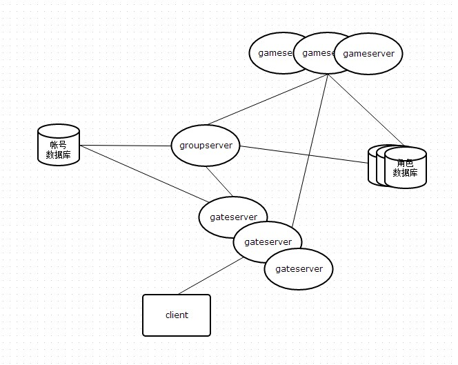
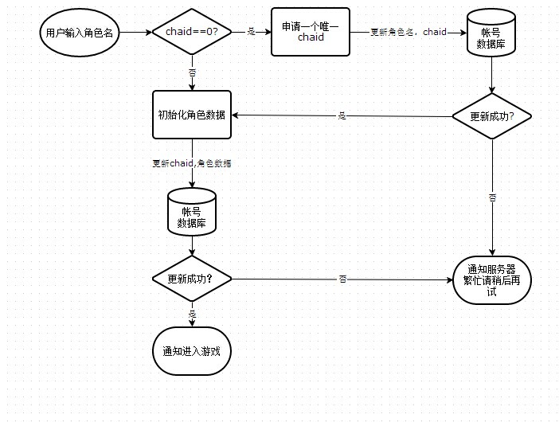

##小型手游服务器

服务器采用C+lua的方式开发.除效率要求高和lua无法实现的部分由C实现外，所有逻辑功能由lua实现.

服务器组结构图:

图中所有连接线均表示tcp长连接.

gateserver:前端连接服务器,可部署多台.负责将玩家的通讯消息转发到内部服务器组/将内部服务器组的消息发往玩家.
完全由C语言编写.每个进程可启动最多8个agentservice线程用于处理用户连接.

groupserver:中心服务器,只有一台.主要负责管理整个服务器组以及处理游戏的全局逻辑.除启动框架外其余逻辑全部由
lua编写

gameserver:战斗及地图服务.负责玩家在游戏场景中的移动，战斗等逻辑.单线程,每个服务上可以加载1-n个场景.除启动
框架以外其余逻辑全部由lua编写。

数据库:数据库采用redis/ssdb。分为两个主要的功能数据库(帐号数据库,角色数据库),其中帐号数据库唯一,保存的数据是
帐号,角色id对,角色数据库可部署多个,通过角色id做hash将角色数据分布到不同的角色数据库中.

###id设计

id用于区分一个进程内的玩家对象.服务器中分为三种id:groupid,gateid,gameid.

groupid:16/32位整型数,大小从1-N,N由使用者配置.服务启动时预先分配N个id并保存到id池中.每当生成一个玩家对象,从id池中分配一个id给玩家，释放对象时将id返回给id池.

gateid:64位整数,数据内容如下,

	|3位aid|13位sessionid|48位identity|

aid可表示0-7的编号，表示gateserver中的第几个agentservice(因此每个gateserver最多启动8个agentservice).

sessionid有效标识1-4095，因此每个agentservice可容纳4095个玩家.

identity唯一编码.用于确保对象的有效性.(identity存在的必要性,假设前一个玩家A断线之后立刻有另一个玩家B上线并复用了前一个玩家的aid和sessionid,假设这个时候因为gameserver的处理延时，一个发给A的包现在到达gateserver，根据aid和sessionid索引到的玩家将是B,这个时候这个消息就会错误的发送给B.identity的作用就是用于跟玩家对象的identity比较，以确定发送目标确实是当前对象)

gameid:32位整数高16字节标识场景,低16字节标识对象.

###移动同步

服务器和客户端均使用网格寻路,服务器和客户端共享同样的寻路网格。为了减少同步移动消息产生的流量.

当客户端请求移动时，将移动请求的目标点发送服务器,由服务器计算出路径.假如路径存在则将这个请求广播给可视客户端.客户端收到请求后,在本地计算路径信息并执行移动.服务器中,有一个定时器以固定的间隔根据路径移动服务器对象,以保证服务器对象的坐标与客户端的对象坐标大体保持一致.如果前一次移动尚未到达目的地，客户端发出新的一次请求，则服务器会丢弃当前路径，并计算新的路径去移动.

###消息广播处理

当groupserver/gameserver要向多个玩家对象发送同一个消息时.将接收消息对象的gateid添加到消息尾部发送给gateserver。gateserver收到消息后根据尾部消息构建一个接收者列表，然后丢弃尾部的额外数据.之后遍历接收者列表将消息发送给它.

###登陆流程

###角色创建流程

